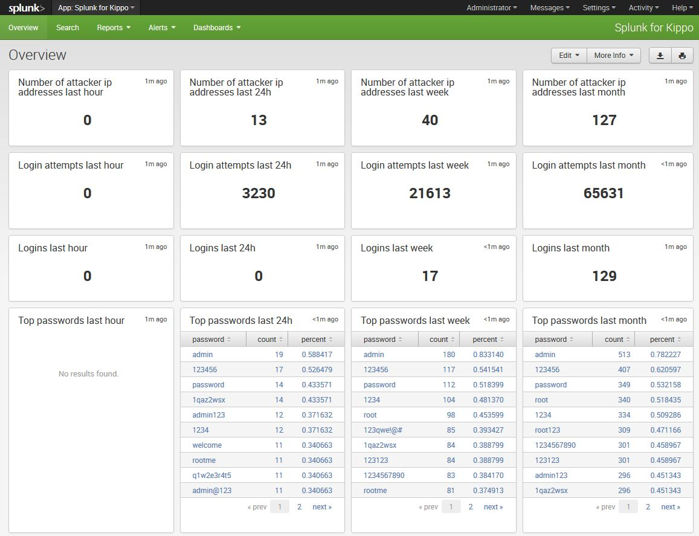

SplunkforKippo
==============

Splunk App for Kippo SSH Honeypot

:Version: 1.0.0
:Source: https://github.com/reusserl/SplunkforKippo

Authors
==========

L\. Reusser 

Contributors
=============

Requirements
=============

Splunk 6.x

Printscreen
===========

Installation
============

Clone this repository to your splunk indexer::

  git clone https://github.com/reusserl/SplunkforKippo.git
  cd SplunkforKippo

Copy the directory splunk_for_kippo (subdirectory of SplunkforKippo) to your app directory::

  cp -a splunk_for_kippo /opt/splunk/etc/apps/
  chown -R splunk:splunk /opt/splunk/etc/apps/splunk_for_kippo

Configuration
=============

Set the email address where you want to receive your alarms in splunk_for_kippo/default/savedsearches.conf. The default is set to root@localhost::

  [Kippo Successful Login]
  action.email = 1
  action.email.inline = 1
  action.email.sendresults = 1
  action.email.to = root@localhost

  ...

  [Kippo Error]
  action.email = 1
  action.email.to = root@localhost
  alert.severity = 4
  alert.suppress = 1
  alert.suppress.period = 12h

  ...

Now you have to restart splunk and everything should be ready::

  /etc/init.d/splunk restart

Forwarder Configuration
=======================

On the systems where you run kippo, you have to configure your splunkforwarders. Add the following lines to 
/opt/splunkforwarder/etc/system/local/inputs.conf::

  [monitor:///path/to/kippo/log/kippo.log]
  sourcetype = kippo
  index = kippo

In my case, kippo is installed in /var/kippo/kippo like this:: 

  root@honeypot01:/var/kippo# ls -l
  total 1184
  lrwxrwxrwx  1 root  root      12 Dec 21 09:58 kippo -> kippo-master
  drwxr-xr-x 10 kippo kippo   4096 Dec 21 09:58 kippo-0.8
  -rw-r--r--  1 kippo kippo 581278 Apr  5  2013 kippo-0.8.tar.gz
  -rw-r--r--  1 kippo kippo   4550 Dec 18 14:29 kippo.cfg
  -rw-r--r--  1 kippo kippo   4821 Dec 21 09:57 kippo.cfg.master
  drwxr-xr-x 10 kippo kippo   4096 Feb 25 18:53 kippo-master
  -rw-r--r--  1 kippo kippo 603811 Dec 21 09:49 kippo-master.zip

My inputs.conf looks like this::

  [monitor:///var/kippo/kippo/log/kippo.log]
  sourcetype = kippo
  index = kippo

Afterward, restart you splunkforwarder::

  /etc/init.d/splunkforwarder restart

Licensing
============

Splunk for Kippo is licensed und GPL v2.

To view a copy of this license, visit [http://www.gnu.org/licenses/gpl-2.0.html].

Contact
===========

L\. Reusser : reusserl@users.noreply.github.com

Contributions
==============

Help and suggestion are always welcome. Feel free to fork and send me push requests.

Have fun!
